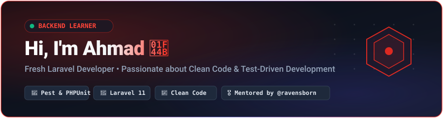

<div align="center">

  

  <br /><br />

  <!-- Status Badges -->
  <p align="center">
    
    
    
    
    
  </p>

</div>

---

### 👨‍💻 About Me

> I am a **fresh backend developer** passionate about the **PHP & Laravel** ecosystem.  
> My philosophy is simple: **learn clean code fundamentals, write tests first, and build with care.**

```php
it('ensures ahmad builds clean, tested backends and stays humble', function () {
    $developer = developer('a4hmad1');

    expect($developer->level)->toBe('Fresh Junior')
        ->and($developer->practices)->toContain('Test-Driven Development', 'Clean Code')
        ->and($developer->testFrameworks)->toBe(['Pest PHP', 'PHPUnit'])
        ->and($developer->mindset)->toBe('Never Stop Learning');
});
```

---

<div align="center">
  <h2>🎖️ My Mentors</h2>
  <p>The developers who continuously challenge me, elevate my standards, and help me grow:</p>
</div>

<table align="center" width="100%">
  <tr>
    <!-- Yad (@ravensborn) -->
    <td align="center" width="50%" valign="top" style="padding: 16px;">
      <a href="https://github.com/ravensborn">
        
      </a>
      <br />
      <b><a href="https://github.com/ravensborn">Yad (@ravensborn)</a></b>
      <br />
      <sub>⭐ <b>Core Mentor • Master of Perfect Testing</b></sub>
      <br /><br />
      <p align="left">
        <i>"Yad is my main teacher who guides me to write <b>perfect tests</b>, think in TDD, and grow my skills and backend ideas every single day. His guidance on testing with Pest &amp; PHPUnit shapes my code discipline and problem-solving mindset."</i>
      </p>
      <div align="center">
        <a href="https://github.com/ravensborn"></a>
        
      </div>
    </td>
    <!-- Zardasht Rwandzi (@codezardasht) -->
    <td align="center" width="50%" valign="top" style="padding: 16px;">
      <a href="https://github.com/codezardasht">
        
      </a>
      <br />
      <b><a href="https://github.com/codezardasht">Zardasht Rwandzi (@codezardasht)</a></b>
      <br />
      <sub>⚡ <b>Senior Backend Mentor • TechnoBase</b></sub>
      <br /><br />
      <p align="left">
        <i>"Tremendous appreciation to Zardasht for inspiring high-level Laravel backend engineering, clean code structure, Eloquent performance patterns, and enterprise development standards."</i>
      </p>
      <div align="center">
        <a href="https://github.com/codezardasht"></a>
        
      </div>
    </td>
  </tr>
</table>

---

<div align="center">
  <h2>🎓 Laracasts &amp; Clean Code Teachers</h2>
  <p>The world-class instructors whose series, books, and patterns inspire my daily practice:</p>
</div>

<table align="center" width="100%">
  <tr>
    <!-- Jeffrey Way -->
    <td align="center" width="25%" valign="top" style="padding: 12px;">
      <a href="https://github.com/jeffreyway">
        
      </a>
      <br />
      <b><a href="https://github.com/jeffreyway">Jeffrey Way</a></b>
      <br />
      <sub>🧼 <b>Clean Code in PHP</b></sub>
      <br />
      <sub><i>Laracasts Founder • OOP</i></sub>
    </td>
    <!-- Luke Downing -->
    <td align="center" width="25%" valign="top" style="padding: 12px;">
      <a href="https://github.com/lukeraymonddowning">
        
      </a>
      <br />
      <b><a href="https://github.com/lukeraymonddowning">Luke Downing</a></b>
      <br />
      <sub>🧪 <b>Testing with Pest</b></sub>
      <br />
      <sub><i>Pest Core Team • TDD</i></sub>
    </td>
    <!-- Jason McCreary -->
    <td align="center" width="25%" valign="top" style="padding: 12px;">
      <a href="https://github.com/jasonmccreary">
        
      </a>
      <br />
      <b><a href="https://github.com/jasonmccreary">Jason McCreary</a></b>
      <br />
      <sub>🔄 <b>Refactoring &amp; Clean Code</b></sub>
      <br />
      <sub><i>Laravel Shift • BaseCode</i></sub>
    </td>
    <!-- Christoph Rumpel -->
    <td align="center" width="25%" valign="top" style="padding: 12px;">
      <a href="https://github.com/christophrumpel">
        
      </a>
      <br />
      <b><a href="https://github.com/christophrumpel">Christoph Rumpel</a></b>
      <br />
      <sub>🛡️ <b>APIs &amp; Testing</b></sub>
      <br />
      <sub><i>Laracasts Author</i></sub>
    </td>
  </tr>
  <tr>
    <!-- Jonathan Reinink -->
    <td align="center" width="25%" valign="top" style="padding: 12px;">
      <a href="https://github.com/reinink">
        
      </a>
      <br />
      <b><a href="https://github.com/reinink">Jonathan Reinink</a></b>
      <br />
      <sub>⚡ <b>Eloquent Performance</b></sub>
      <br />
      <sub><i>Subqueries &amp; Indexing</i></sub>
    </td>
    <!-- Mohamed Said -->
    <td align="center" width="25%" valign="top" style="padding: 12px;">
      <a href="https://github.com/themsaid">
        
      </a>
      <br />
      <b><a href="https://github.com/themsaid">Mohamed Said</a></b>
      <br />
      <sub>📬 <b>Queues in Action</b></sub>
      <br />
      <sub><i>Async Workers &amp; Redis</i></sub>
    </td>
    <!-- Aaron Francis -->
    <td align="center" width="25%" valign="top" style="padding: 12px;">
      <a href="https://github.com/aarondfrancis">
        
      </a>
      <br />
      <b><a href="https://github.com/aarondfrancis">Aaron Francis</a></b>
      <br />
      <sub>🗄️ <b>Database Design</b></sub>
      <br />
      <sub><i>High-Performance SQL</i></sub>
    </td>
    <!-- Freek Van der Herten -->
    <td align="center" width="25%" valign="top" style="padding: 12px;">
      <a href="https://github.com/freekmurze">
        
      </a>
      <br />
      <b><a href="https://github.com/freekmurze">Freek Van der Herten</a></b>
      <br />
      <sub>🧱 <b>Beyond CRUD Architecture</b></sub>
      <br />
      <sub><i>Spatie • Clean Backend</i></sub>
    </td>
  </tr>
</table>

---

### 🎯 Am I Fresh? (My Level & Learning Edge)

I believe in transparency. I am a **Fresh Junior Developer** who is building strong foundations:

- 🟢 **What I Practice Daily:**
  - Modern PHP basics (OOP, types, clean functions)
  - Laravel Core (Routing, Controllers, Models, Form Requests)
  - **Automated Testing** with **Pest PHP** & **PHPUnit** (Feature & Unit tests)
  - MySQL database schemas & Eloquent relationships
  - Linux CLI & Git branch workflows

- 🟡 **What I Am Exploring Next:**
  - Redis Queues & Async background workers
  - Secure REST API design with Laravel Sanctum
  - Refactoring smells & applying single responsibility

> 💬 **Help me calibrate my skills!** If you are a mentor, senior engineer, or reviewer: inspect my repositories, challenge my test coverage, or share your feedback. Every critique helps me become a better engineer!

---

### 🛠️ Tech Stack

<div align="center">
  <a href="https://skillicons.dev">
    
  </a>
</div>

---

### 📦 Practice Repositories

<table align="center" width="100%">
  <tr>
    <td width="50%" valign="top" style="padding: 12px;">
      <b>🔐 <a href="https://github.com/a4hmad1/auth-package">auth-package</a></b>
      <br />
      <sub>Laravel authentication kit with multi-driver support and automated tests.</sub>
      <br /><br />
      
      
      
    </td>
    <td width="50%" valign="top" style="padding: 12px;">
      <b>⚡ <a href="https://github.com/a4hmad1/laravel-queue-mastery">laravel-queue-mastery</a></b>
      <br />
      <sub>Practicing asynchronous queue workers, Redis jobs, and task scheduling.</sub>
      <br /><br />
      
      
    </td>
  </tr>
  <tr>
    <td width="50%" valign="top" style="padding: 12px;">
      <b>🏗️ <a href="https://github.com/a4hmad1/laravel-mastery">laravel-mastery</a></b>
      <br />
      <sub>Clean architecture practice, Form Request validation, and service classes.</sub>
      <br /><br />
      
      
    </td>
    <td width="50%" valign="top" style="padding: 12px;">
      <b>🌐 <a href="https://github.com/a4hmad1/Blog-APi">Blog-APi</a></b>
      <br />
      <sub>RESTful API practice project tested end-to-end with Pest PHP.</sub>
      <br /><br />
      
      
    </td>
  </tr>
</table>

---

### 📈 Activity & Streak

<div align="center">
  <a href="https://github.com/a4hmad1">
    
  </a>
</div>

---

<div align="center">
  <sub>Mentored with gratitude by <a href="https://github.com/ravensborn">@ravensborn</a> &amp; <a href="https://github.com/codezardasht">@codezardasht</a> • Continuous learner on <a href="https://laracasts.com">Laracasts</a></sub>
</div>
